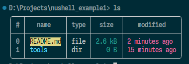
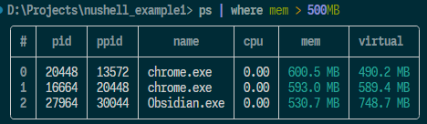
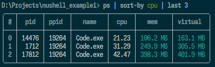
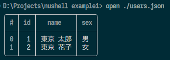
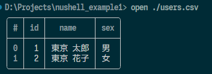
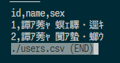
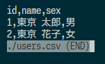

# nushell_example1

## 概要
* Nushell (ニューシェル) を試してみる

Nushell  
https://www.nushell.sh/ja/  
新しいタイプのシェル  
* **あらゆるOSを制御するパイプライン**
  Nuは、Linux、macOS、Windowsで動作します。一度身に付ければ、どこでも使えるようになります。
* **すべてはデータである**
  Nuパイプラインは構造化されたデータを使用するため、毎回同じ方法で安全に選択、フィルタリング、ソートを行うことができます。文字列をパースするのをやめて、問題を解決しましょう。
* **強力なプラグイン**
  強力なプラグインシステムを使って、Nuを簡単に拡張することができます。
* **Nu は既存のデータとの連携が可能**
  Nu はJSON, YAML, XML, Excel and moreを標準サポートしています。ファイル、データベース、Web API など、どのようなデータでも簡単に Nu パイプラインに取り込むことができます。
* **Nu のエラーメッセージは非常に分かりやすい**
  Nu は型付けされたデータを操作するので、他のシェルでは見つけられないバグを発見することができます。そして、壊れたときには、どこで、なぜ壊れたかを正確に教えてくれます。

## 結果
もう全部これでいいんじゃないかな

## 詳細

### インストール
※今回は実行ファイルをダウンロード  

https://github.com/nushell/nushell/releases/tag/0.102.0  
nu-0.102.0-x86_64-pc-windows-msvc.zip  
※zip で 40 MB 展開後は 120 MB 🙄おっふ 

```
> dir 

    Directory: D:\Projects\nushell_example1\tools\Nushell

Mode                 LastWriteTime         Length Name
----                 -------------         ------ ----
-a---          2025/02/05     1:21         372224 less.exe
-a---          2025/02/05     0:50           1115 LICENSE
-a---          2025/02/05     1:21         241825 LICENSE-for-less.txt
-a---          2025/02/05     1:17        5648384 nu_plugin_custom_values.exe
-a---          2025/02/05     1:10        6017024 nu_plugin_example.exe
-a---          2025/02/05     1:13        6169600 nu_plugin_formats.exe
-a---          2025/02/05     1:11        6727680 nu_plugin_gstat.exe
-a---          2025/02/05     1:08        2678784 nu_plugin_inc.exe
-a---          2025/02/05     1:21       62441472 nu_plugin_polars.exe
-a---          2025/02/05     1:14        6969856 nu_plugin_query.exe
-a---          2025/02/05     1:15         439296 nu_plugin_stress_internals.exe
-a---          2025/02/05     1:18       30409728 nu.exe
-a---          2025/02/05     1:21            339 README.txt
```

### nu.exe の実行

```
> .\tools\Nushell\nu.exe
     __  ,
 .--()°'.' Welcome to Nushell,
'|, . ,'   based on the nu language,
 !_-(_\    where all data is structured!

Version: 0.102.0 (windows-x86_64)
Please join our Discord community at https://discord.gg/NtAbbGn
Our GitHub repository is at https://github.com/nushell/nushell
Our Documentation is located at https://nushell.sh
And the Latest Nushell News at https://nushell.sh/blog/
Learn how to remove this at: https://nushell.sh/book/configuration.html#remove-welcome-message

It's been this long since Nushell's first commit:
5yrs 9months 27days 7hrs 10mins 41secs 900ns

Startup Time: 17ms 333µs 400ns
```

### コマンドを叩いてみる
```
> ls
╭───┬───────────┬──────┬────────┬────────────────╮
│ # │   name    │ type │  size  │    modified    │
├───┼───────────┼──────┼────────┼────────────────┤
│ 0 │ README.md │ file │ 2.6 kB │ 2 minutes ago  │
│ 1 │ tools     │ dir  │    0 B │ 15 minutes ago │
╰───┴───────────┴──────┴────────┴────────────────╯
```



```
> ps
╭─────┬───────┬───────┬─────────────────────────────┬───────┬──────────┬──────────╮
│   # │  pid  │ ppid  │            name             │  cpu  │   mem    │ virtual  │
├─────┼───────┼───────┼─────────────────────────────┼───────┼──────────┼──────────┤
│   0 │  8848 │  3244 │ sihost.exe                  │  0.00 │  37.6 MB │  13.0 MB │
│   1 │   900 │   936 │ svchost.exe                 │  0.00 │  39.1 MB │  18.0 MB │
│   2 │  1376 │   936 │ svchost.exe                 │  0.00 │  44.7 MB │  11.8 MB │
～～～～～～～～～～～～～～～～～～～～～～～～～～～～～～～～～～～～～～～～～～～～～～
│ 180 │ 27124 │ 32216 │ dotnet.exe                  │  0.00 │  29.9 MB │  12.5 MB │
│ 181 │ 17624 │   676 │ RuntimeBroker.exe           │  0.00 │  13.6 MB │   2.3 MB │
│ 182 │ 12228 │ 20448 │ chrome.exe                  │  0.00 │  51.3 MB │  26.2 MB │
├─────┼───────┼───────┼─────────────────────────────┼───────┼──────────┼──────────┤
│   # │  pid  │ ppid  │            name             │  cpu  │   mem    │ virtual  │
╰─────┴───────┴───────┴─────────────────────────────┴───────┴──────────┴──────────╯
```
```
> ps | where mem > 500MB
╭───┬───────┬───────┬──────────────┬──────┬──────────┬──────────╮
│ # │  pid  │ ppid  │     name     │ cpu  │   mem    │ virtual  │
├───┼───────┼───────┼──────────────┼──────┼──────────┼──────────┤
│ 0 │ 20448 │ 13572 │ chrome.exe   │ 0.00 │ 600.5 MB │ 490.2 MB │
│ 1 │ 16664 │ 20448 │ chrome.exe   │ 0.00 │ 593.0 MB │ 589.4 MB │
│ 2 │ 27964 │ 30044 │ Obsidian.exe │ 0.00 │ 530.7 MB │ 748.7 MB │
╰───┴───────┴───────┴──────────────┴──────┴──────────┴──────────╯
```
  
※mem や virtual は文字列ではなく Filesize 型で MB などの単位は表示上のフォーマット。例えば以下は上記と同じ結果になる。  
```
> ps | where mem > 0.5GB
╭───┬───────┬───────┬──────────────┬──────┬──────────┬──────────╮
│ # │  pid  │ ppid  │     name     │ cpu  │   mem    │ virtual  │
├───┼───────┼───────┼──────────────┼──────┼──────────┼──────────┤
│ 0 │ 20448 │ 13572 │ chrome.exe   │ 0.00 │ 602.5 MB │ 491.1 MB │
│ 1 │ 16664 │ 20448 │ chrome.exe   │ 0.00 │ 590.8 MB │ 583.7 MB │
│ 2 │ 27964 │ 30044 │ Obsidian.exe │ 0.00 │ 530.2 MB │ 748.1 MB │
╰───┴───────┴───────┴──────────────┴──────┴──────────┴──────────╯
```

ps の結果から cpu 使用率の昇順でソートして下から 3 件取得
```
> ps | sort-by cpu | last 3
╭───┬───────┬───────┬──────────┬───────┬──────────┬──────────╮
│ # │  pid  │ ppid  │   name   │  cpu  │   mem    │ virtual  │
├───┼───────┼───────┼──────────┼───────┼──────────┼──────────┤
│ 0 │ 14476 │ 19264 │ Code.exe │ 21.23 │ 106.2 MB │ 163.1 MB │
│ 1 │  1712 │ 19264 │ Code.exe │ 31.29 │ 249.9 MB │ 305.5 MB │
│ 2 │ 17812 │ 19264 │ Code.exe │ 42.47 │ 398.3 MB │ 401.9 MB │
╰───┴───────┴───────┴──────────┴───────┴──────────┴──────────╯
```


ps の結果から cpu 使用率の降順でソートして上から 3 件取得
```
> ps | sort-by -r cpu | first 3
╭───┬───────┬───────┬──────────┬───────┬──────────┬──────────╮
│ # │  pid  │ ppid  │   name   │  cpu  │   mem    │ virtual  │
├───┼───────┼───────┼──────────┼───────┼──────────┼──────────┤
│ 0 │ 14476 │ 19264 │ Code.exe │ 21.23 │ 106.2 MB │ 163.1 MB │
│ 1 │  1712 │ 19264 │ Code.exe │ 31.29 │ 249.9 MB │ 305.5 MB │
│ 2 │ 17812 │ 19264 │ Code.exe │ 42.47 │ 398.3 MB │ 401.9 MB │
╰───┴───────┴───────┴──────────┴───────┴──────────┴──────────╯
```

### open
#### json
```
> open ./users.json
╭───┬────┬───────────┬─────╮
│ # │ id │   name    │ sex │
├───┼────┼───────────┼─────┤
│ 0 │  1 │ 東京 太郎 │ 男  │
│ 1 │  2 │ 東京 花子 │ 女  │
╰───┴────┴───────────┴─────╯
```


#### csv
```
> open ./users.csv
╭───┬────┬───────────┬─────╮
│ # │ id │   name    │ sex │
├───┼────┼───────────┼─────┤
│ 0 │  1 │ 東京 太郎 │ 男  │
│ 1 │  2 │ 東京 花子 │ 女  │
╰───┴────┴───────────┴─────╯
```



#### yaml
```
> open ./users.yaml
╭───┬────┬───────────┬─────╮
│ # │ id │   name    │ sex │
├───┼────┼───────────┼─────┤
│ 0 │  1 │ 東京 太郎 │ 男  │
│ 1 │  2 │ 東京 花子 │ 女  │
╰───┴────┴───────────┴─────╯
```

#### toml
```
> open ./users.toml
╭───────┬──────────────────────────────╮
│       │ ╭───┬────┬───────────┬─────╮ │
│ users │ │ # │ id │   name    │ sex │ │
│       │ ├───┼────┼───────────┼─────┤ │
│       │ │ 0 │  1 │ 東京 太郎 │ 男  │ │
│       │ │ 1 │  2 │ 東京 花子 │ 女  │ │
│       │ ╰───┴────┴───────────┴─────╯ │
╰───────┴──────────────────────────────╯
```

```
> open ./users.toml | get users
╭───┬────┬───────────┬─────╮
│ # │ id │   name    │ sex │
├───┼────┼───────────┼─────┤
│ 0 │  1 │ 東京 太郎 │ 男  │
│ 1 │  2 │ 東京 花子 │ 女  │
╰───┴────┴───────────┴─────╯
```

### excel
※ xlsx 以外の拡張子はエラー  
※ 普通に数値で入力したセルは整数ではなく小数で認識されている  
※ 1行目が列名にならない（回避策は後述）  

```
> open ./users.xls
Error: nu::shell::io::invalid_data

  × I/O error
   ╭─[entry #30:1:1]
 1 │ open ./users.xls
   · ──┬─
   ·   ╰── Invalid data
   ╰────

> open ./users.xlsx
╭────────┬───────────────────────────────────────╮
│        │ ╭───┬─────────┬───────────┬─────────╮ │
│ Sheet1 │ │ # │ column0 │  column1  │ column2 │ │
│        │ ├───┼─────────┼───────────┼─────────┤ │
│        │ │ 0 │ id      │ name      │ sex     │ │
│        │ │ 1 │    1.00 │ 東京 太郎 │ 男      │ │
│        │ │ 2 │    2.00 │ 東京 花子 │ 女      │ │
│        │ ╰───┴─────────┴───────────┴─────────╯ │
╰────────┴───────────────────────────────────────╯
> open ./users.xlsm
PK!!Error: nu::shell::io::invalid_data

  × I/O error
   ╭─[entry #32:1:1]
 1 │ open ./users.xlsm
   · ──┬─
   ·   ╰── Invalid data
   ╰────

> open ./users.xlsb
PK!مncError: nu::shell::io::invalid_data

  × I/O error
   ╭─[entry #33:1:1]
 1 │ open ./users.xlsb
   · ──┬─
   ·   ╰── Invalid data
   ╰────  
```

```
> open ./users.xlsx | get sheet1 | headers
╭───┬──────┬───────────┬─────╮
│ # │  id  │   name    │ sex │
├───┼──────┼───────────┼─────┤
│ 0 │ 1.00 │ 東京 太郎 │ 男  │
│ 1 │ 2.00 │ 東京 花子 │ 女  │
╰───┴──────┴───────────┴─────╯
```
```
> open ./users.xlsx | get sheet1 | headers | where id == 2
╭───┬──────┬───────────┬─────╮
│ # │  id  │   name    │ sex │
├───┼──────┼───────────┼─────┤
│ 0 │ 2.00 │ 東京 花子 │ 女  │
╰───┴──────┴───────────┴─────╯
> open ./users.xlsx | get sheet1 | headers | where sex == 男
╭───┬──────┬───────────┬─────╮
│ # │  id  │   name    │ sex │
├───┼──────┼───────────┼─────┤
│ 0 │ 1.00 │ 東京 太郎 │ 男  │
╰───┴──────┴───────────┴─────╯
```

### 変換
#### Excel to YAML
```
> open ./users.xlsx | get sheet1 | headers | to yaml
- id: 1.0
  name: 東京 太郎
  sex: 男
- id: 2.0
  name: 東京 花子
  sex: 女
```

#### Excel to CSV
```
> open ./users.xlsx | get sheet1 | headers | to csv
id,name,sex
1,東京 太郎,男
2,東京 花子,女
```

#### YAML to CSV
```
> open ./users.yaml | to csv
id,name,sex
1,東京 太郎,男
2,東京 花子,女
```

### スクリプト

#### VSCode 拡張機能

vscode-nushell-lang  
https://marketplace.visualstudio.com/items?itemName=TheNuProjectContributors.vscode-nushell-lang  


#### hello.nu
```nu
#!/usr/bin/env nu

def greet [name:string] {
  $"Hello ($name)!"
}

greet "Nushell"
```
```
> source ./hello.nu
Hello Nushell!
```

### nu.exe だけで動作するか？

nu_plugin_XXXXX がそこそこサイズがあるので最小構成(nu.exeのみ)で動作するか確認。  
→ nu.exe 単体で動作する

※そもそも README.txt を見ると

サイズ: 120 MB → 30 MB
```
PS D:\Projects\nushell_example1\tools\Nushell> dir

    Directory: D:\Projects\nushell_example1\tools\Nushell

Mode                 LastWriteTime         Length Name
----                 -------------         ------ ----
-a---          2025/02/05     0:50           1115 LICENSE
-a---          2025/02/05     1:18       30409728 nu.exe
-a---          2025/02/05     1:21            339 README.txt
```

とりあえず起動する
```
> ./tools/Nushell/nu.exe
     __  ,
 .--()°'.' Welcome to Nushell,
'|, . ,'   based on the nu language,
 !_-(_\    where all data is structured!

Version: 0.102.0 (windows-x86_64)
Please join our Discord community at https://discord.gg/NtAbbGn
Our GitHub repository is at https://github.com/nushell/nushell
Our Documentation is located at https://nushell.sh
And the Latest Nushell News at https://nushell.sh/blog/
Learn how to remove this at: https://nushell.sh/book/configuration.html#remove-welcome-message

It's been this long since Nushell's first commit:
5yrs 9months 27days 9hrs 3mins 45secs 800ns

Startup Time: 18ms 150µs 800ns
```

```
> source ./hello.nu
Hello Nushell!
```

```
> open ./users.xlsx | get sheet1 | headers | to yaml
- id: 1.0
  name: 東京 太郎
  sex: 男
- id: 2.0
  name: 東京 花子
  sex: 女
```

```
> ps | where mem > 0.5GB
╭───┬───────┬───────┬──────────────┬───────┬──────────┬──────────╮
│ # │  pid  │ ppid  │     name     │  cpu  │   mem    │ virtual  │
├───┼───────┼───────┼──────────────┼───────┼──────────┼──────────┤
│ 0 │ 20448 │ 13572 │ chrome.exe   │  5.02 │ 586.3 MB │ 495.4 MB │
│ 1 │ 16664 │ 20448 │ chrome.exe   │  0.00 │ 592.9 MB │ 595.5 MB │
│ 2 │ 27964 │ 30044 │ Obsidian.exe │  0.00 │ 531.4 MB │ 747.9 MB │
│ 3 │ 17812 │ 19264 │ Code.exe     │ 16.45 │ 569.2 MB │ 580.6 MB │
╰───┴───────┴───────┴──────────────┴───────┴──────────┴──────────╯
```

### less.exe が UTF8 で文字化け

  

less って何？
→　以下の Windows 版っぽい

lessコマンドガイド：Linux初心者のための基本から応用まで  
https://envader.plus/article/292  
> `less` コマンドは、Linux や UNIX のようなオペレーティングシステムで使われるテキストファイルを表示するためのツールです。「less」という名前は、「less is more（少ない方がより多い）」というフレーズにちなんでいるとされており、このコマンドが開発された当初、先行する `more` コマンドよりも多機能であることを示していました。
> `less` コマンドは特に大きなファイル、絶えず内容が更新されるログファイルなどを効率的に扱うために設計されています。

以下で解消
```
$env.LESSCHARSET = utf-8
```

